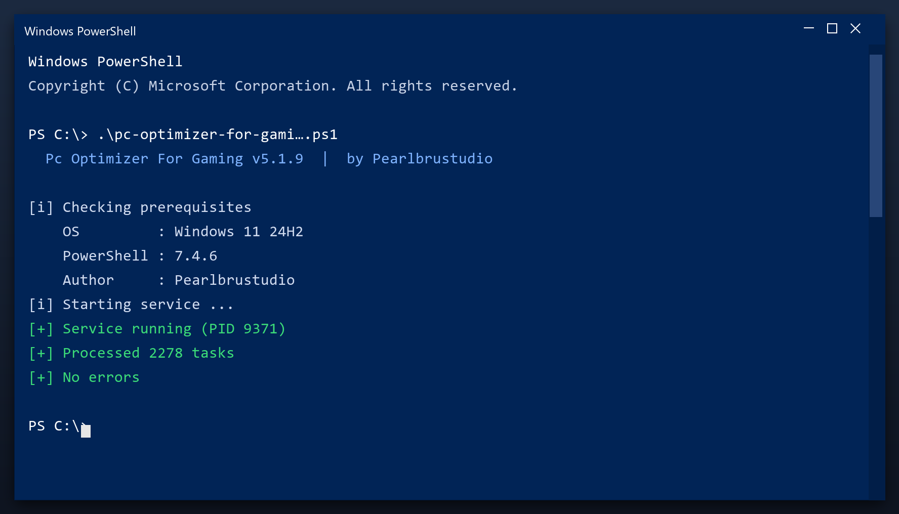

# Pc Optimizer For Gaming — Free Download [2026]

  

**At a glance**

| | |
| --- | --- |
| **Program** | Pc Optimizer For Gaming |
| **Version** | Latest 2026 build |
| **Price** | Free |
| **Systems** | see requirements below |
| **Download** | Quick Start section below |

---

Download pc optimizer for gaming for free. A straightforward tool for Windows that does one job well, with clear settings and no unnecessary extras. **100% free. No account needed.**

  

## 1. Overview

Pc optimizer for gaming is a small Windows tool for routine maintenance. You do not need to understand the technical details - it reports what it found in plain language and only changes things after you agree. Nothing runs in the background and nothing phones home.

| **Term** | **Meaning** |
| --- | --- |
| **Plain language** | No technical jargon |
| **Report** | A summary of what was found |
| **Confirm** | You approve before changes |
| **No telemetry** | Nothing is sent anywhere |

## 2. Technical Details

| **Feature** | **Details** |
| --- | --- |
| **Interface** | Single window, no clutter |
| **Learning curve** | None - obvious buttons |
| **Languages** | English |
| **Permissions** | Admin for some tasks |
| **Conflicts** | None with other tools |
| **Uninstall** | Clean, leaves nothing behind |

## 3. System Requirements

| **Component** | **Requirement** |
| --- | --- |
| **Operating system** | Windows 10 or 11 (64-bit) |
| **RAM** | 2 GB or more |
| **Free disk space** | 100 MB |
| **Permissions** | Administrator (for some tasks) |

## 4. Installation

1. **Download** and unzip the package
2. **Right-click** the program and choose Run as administrator
3. **Choose a scan type** (quick or deep)
4. **Wait** for the report
5. **Select** the items to remove and confirm

  

> **Note:** run the tool as administrator so it can clean system folders. Without admin rights it will only touch your own user files.

## 5. What's Included

| **Component** | **Details** |
| --- | --- |
| **Executable** | The tool itself |
| **Config** | Defaults already set |
| **Guide** | Plain-language walkthrough |
| **Support** | Issues section in this repo |

## 6. Comparison

| **Feature** | **Doing it by hand** | **pc optimizer for gaming** |
| --- | --- | --- |
| **Time** | Hours | Minutes |
| **Risk** | Deleting the wrong file | Safe preview first |
| **Knowledge** | Needed | None |
| **Repeatable** | No | Yes, scheduled |

## 7. Common Issues

| **Issue** | **Fix** |
| --- | --- |
| **Windows warns about the file** | Click More info, then Run anyway |
| **Slow first launch** | Normal - it indexes on first run |
| **Scan finds nothing** | Good - your PC is already clean |
| **Settings do not save** | Run as admin once so it can write config |

## 8. Maintenance Tips

- Empty the Recycle Bin first for a clearer picture
- Uninstall programs you no longer use before scanning
- Close browsers so their caches can be cleared
- Save your work before a full cleanup
- Reboot once the cleanup is done

## 9. Frequently Asked Questions

**Is admin access required?**

For a full cleanup, yes. Without it the tool only cleans your user folders.

**Will it fix my registry?**

It can scan and repair broken entries, and it backs up before changing anything.

**Does it work offline?**

Yes - once downloaded it needs no internet connection.

**How much space will I save?**

It varies, but most PCs recover several gigabytes on the first run.

---

*sharp-cyclone-579 · Updated 2026-10-10 · Shared under the MIT License*
